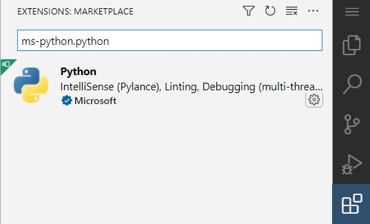

# Getting started

To participate, you need a handful of tools:

1. An editor
2. An interpreter
3. A package manager

## Editor

For this series, we will use _Visual Studio Code_.  This is an extensible
editor powered through extensions to be able to edit any source file.

[Download vscode][]

A mandatory extension we will use is `ms-python.python`.  You can find it
through the extensions interface in vscode.  [Here is a link](https://code.visualstudio.com/docs/languages/python)
for getting started.



Additional useful extensions are:

* `usernamehw.errorlens` (provides editor-inline errors)
* `bungcip.better-toml` (features for our package manager file)

## Interpreter

Our language of focus here is _Python_.  It is an interpreted programming
language which makes it fall under the category of _scripting_ languages.  Feel
free to install Python with all of its features.

[Download python][]

## Package Manager

Most programming languages have an ecosystem of packages that the community
authors and shares for others to use.  In Python, we use `pypi.org` as the
registry for these packages, but there exist a few different tools to interact
with this registry.  For this series, we will use _Poetry_.

[Getting started with Poetry][]

A quick how-to:

```powershell
Set-ExecutionPolicy -Scope Session -ExecutionPolicy Bypass

Invoke-WebRequest -Uri https://install.python-poetry.org -OutFile "${HOME}\install-poetry.py" -UseBasicParsing
Get-Content -Path "${HOME}\install-poetry.py" -Raw | py.exe -

$poetryRoot = "${Env:APPDATA}\Python\Scripts"
$path = [Environment]::GetEnvironmentVariable('PATH', 'User').
    Split(';').
    Where{ -not [string]::IsNullOrWhiteSpace($PSItem) }
if ($path -notcontains $poetryRoot) {
    $path = @($path; $poetryRoot) -join ';'
    [Environment]::SetEnvironmentVariable('PATH', $path, 'User')
}
```

[Download vscode]: <https://code.visualstudio.com/download>
[Download python]: <https://www.python.org/downloads/>
[Getting started with Poetry]: <https://python-poetry.org>
